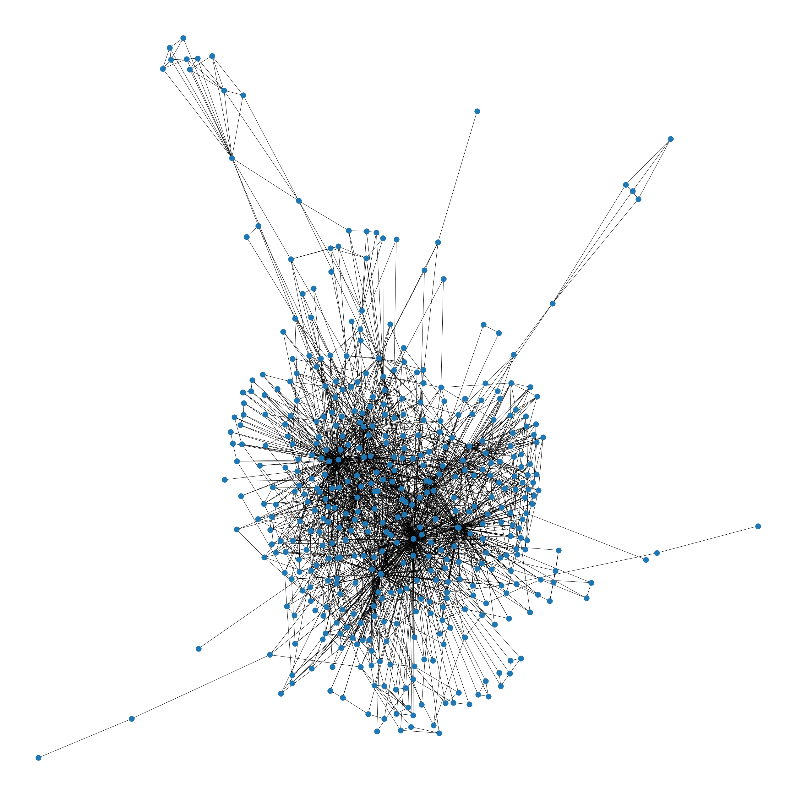
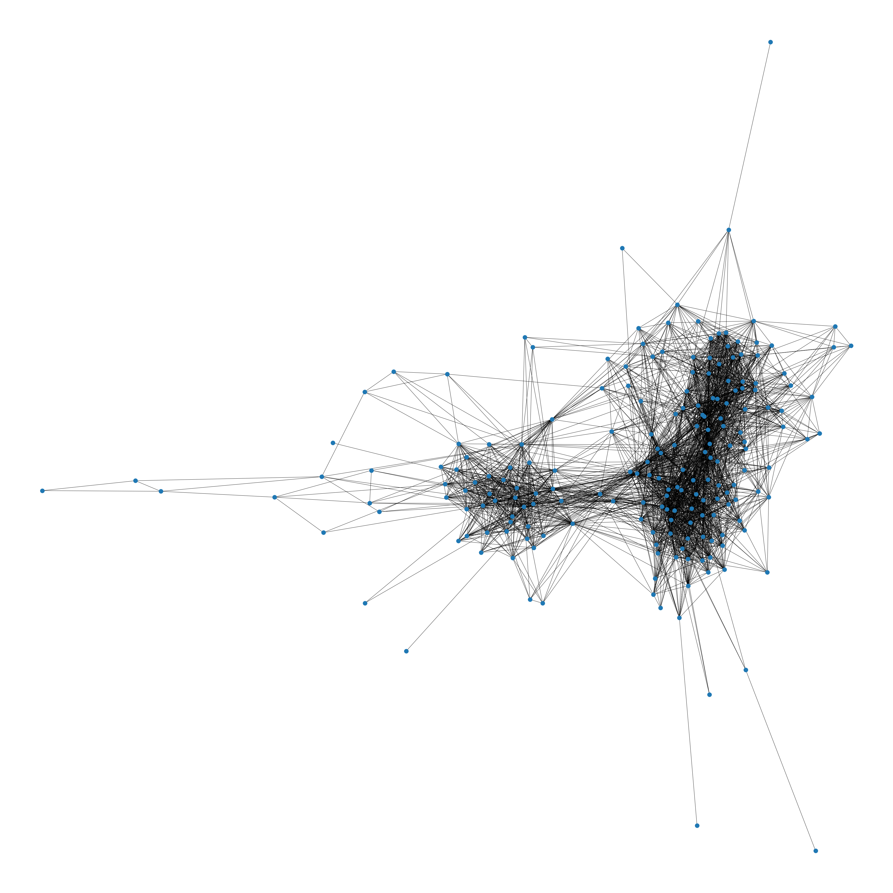
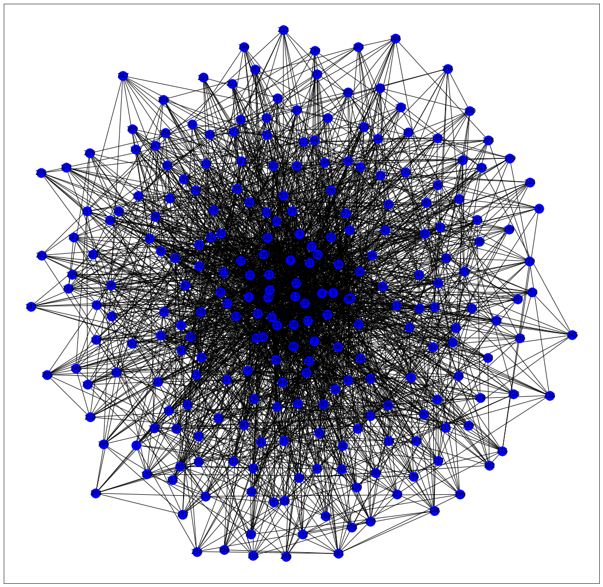

# Social Network Graphs:
Graphical representation of social relationships

# Datasets:
1. Caenorhabditis Network

2. Jazz Network

# Modules:
1. Compute centrality measures, clustering coefficients (both local and global), and reciprocity and transitivity using appropriate algorithms for the both datasets.

2. Use an algorithm package in Python to find the maximum connected component in a given graph G. Let us denote the number of nodes in the giant component of graph G as N_G. Vary ⟨k⟩ from 0 to 5 with an increment of 0.1. For each value of ⟨k⟩ find the ratio N_G/N where N is the number of nodes in the graph. Plot this ratio with respect to ⟨k⟩. Take ⟨k⟩ as x-axis and ratio N_G/N as y-axis.

3. Find the giant component G in the network. Let N_G denote the number of nodes in G. Find N_G/N where N is the total number of nodes in the network for the selected datasets.

4. Apply Girvan Newman algorithm and Ravasaz algorithm to find the communities step by step and illustrate at each step the communities got and stop after 5 steps. Show all the communities and give your understanding about the communities that you got through the algorithm. Looking at the output given by the two algorithms compare and contrast the two algorithms.

5. Create a scale-free network using the appropriate Python package. Apply Independent Cascade Model to find the maximum number of steps required to get to the maximum number of nodes. This you may repeat 5 times by starting from different nodes and see how many steps are required for the above. Activation probabilities for the pair of nodes that are needed for ICM can be assigned randomly. When you are assigning it randomly note this point: from a node say v if there are three edges to different vertices w, x, y. Then it should be p(v,w)+p(v,x)+p(v,y)=1.

